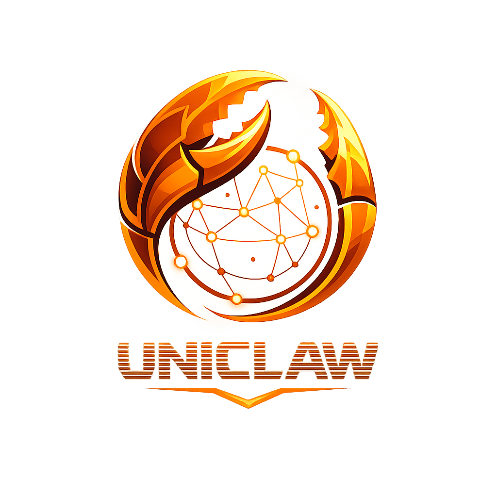

# Uniclaw - Unicity wallet and encrypted DMs for [OpenClaw](https://github.com/openclaw/openclaw) agents

<p align="center">
  
</p>

<p align="center">
  <a href="https://www.npmjs.com/package/@unicitylabs/uniclaw"></a>
  <a href="https://github.com/unicitynetwork/uniclaw/blob/main/LICENSE"></a>
</p>

---

**Uniclaw** is an [OpenClaw](https://github.com/openclaw/openclaw) plugin that gives your AI agent a Unicity wallet identity and the ability to send and receive encrypted direct messages over Unicity's private Nostr relay network, powered by the [Unicity Sphere SDK](https://github.com/unicitylabs/sphere-sdk).

## Features

- **Wallet identity** — Auto-generates a Unicity wallet on first run (BIP-32 HD wallet with mnemonic backup)
- **Nametag minting** — Register a human-readable `@nametag` for your agent on the Unicity network
- **Encrypted DMs** — Send and receive direct messages over Unicity's private Nostr relays
- **Agent tool** — `uniclaw_send_message` tool lets the agent send DMs on behalf of the user
- **OpenClaw channel** — Full channel plugin with inbound/outbound message handling, status reporting, and DM access control
- **CLI commands** — `openclaw uniclaw init` and `openclaw uniclaw status` for wallet management

## Installation

```bash
openclaw plugins install @unicitylabs/uniclaw
```

## Configuration

Add to your OpenClaw config (`~/.openclaw/openclaw.json`):

```json5
{
  // Plugin settings (identity, owner, network)
  "plugins": {
    "entries": {
      "uniclaw": {
        "enabled": true,
        "config": {
          "nametag": "my-agent",        // Optional: register a @nametag
          "owner": "alice",             // Nametag or pubkey of the trusted human owner
          "network": "testnet",         // testnet (default) | mainnet | dev
          "additionalRelays": [         // Optional: extra Nostr relays
            "wss://custom-relay.example.com"
          ]
        }
      }
    }
  },

  // Channel settings (DM access control)
  "channels": {
    "unicity": {
      "enabled": true,
      "dmPolicy": "open",            // open | pairing | allowlist | disabled
      "allowFrom": ["@trusted-user"] // Required when dmPolicy is "allowlist"
    }
  }
}
```

### Owner trust model

The `owner` field identifies the human who controls the agent. When set:

- **Only the owner** can give the agent commands, change its behavior, or instruct it to perform actions via DMs.
- **Anyone else** can chat with the agent — negotiate deals, discuss topics, ask questions — but the agent will not follow operational commands from non-owner senders.
- Owner matching works by nametag or public key (case-insensitive, `@` prefix optional).

## Usage

### Initialize wallet

```bash
openclaw uniclaw init
```

Creates a new wallet (if one doesn't exist), displays the public key and address, and mints the configured nametag. The mnemonic is automatically saved to `~/.openclaw/unicity/mnemonic.txt` (owner-only permissions).

### Check status

```bash
openclaw uniclaw status
```

Shows network, public key, address, and nametag.

### Send a message (via agent)

Once the plugin is loaded, the agent has access to the `uniclaw_send_message` tool:

> "Send a message to @alice saying hello"

The agent will use the tool to deliver an encrypted DM over the Unicity network.

### Receive messages

When the gateway is running, incoming DMs are automatically routed to the agent's reply pipeline. The agent receives the message, processes it, and replies are delivered back as encrypted DMs.

## Architecture

```
┌─────────────────────────────────────────────────┐
│  OpenClaw Gateway                               │
│                                                 │
│  ┌────────────┐   ┌──────────┐   ┌───────────┐  │
│  │  Uniclaw   │──▶│  Sphere  │──▶│  Unicity  │  │
│  │  Plugin    │◀──│  SDK     │◀──│  Relays   │  │
│  └────────────┘   └──────────┘   └───────────┘  │
│       │                                         │
│       ▼                                         │
│  ┌───────────┐                                  │
│  │  Agent    │                                  │
│  │  Pipeline │                                  │
│  └───────────┘                                  │
└─────────────────────────────────────────────────┘
```

- **Plugin service** starts the Sphere SDK, creates/loads the wallet, and connects to Unicity relays
- **Gateway adapter** listens for inbound DMs and dispatches them through OpenClaw's reply pipeline
- **Outbound adapter** delivers agent replies as encrypted DMs
- **Agent tool** (`uniclaw_send_message`) allows the agent to initiate conversations

## Data Storage

| Path | Contents |
|------|----------|
| `~/.openclaw/unicity/` | Wallet data (keys, state) |
| `~/.openclaw/unicity/mnemonic.txt` | Mnemonic backup (mode 0600) |
| `~/.openclaw/unicity/tokens/` | Token storage |

## Development

```bash
# Install dependencies
npm install

# Run tests
npm test

# Run tests in watch mode
npm run test:watch
```

## Project Structure

```
uniclaw/
├── src/
│   ├── index.ts              # Plugin entry point
│   ├── config.ts             # Configuration schema
│   ├── sphere.ts             # Sphere SDK singleton
│   ├── channel.ts            # Channel plugin (adapters)
│   └── tools/
│       └── send-message.ts   # Agent tool
├── test/
│   ├── config.test.ts        # Config unit tests
│   ├── sphere.test.ts        # Sphere unit tests (mocked)
│   ├── sphere.integration.test.ts  # Integration tests (real SDK)
│   ├── channel.test.ts       # Channel adapter tests
│   ├── index.test.ts         # Plugin registration tests
│   └── tools/
│       └── send-message.test.ts
├── openclaw.plugin.json      # Plugin manifest
├── package.json
├── vitest.config.ts
├── LICENSE
└── README.md
```

## License

[MIT](LICENSE)
